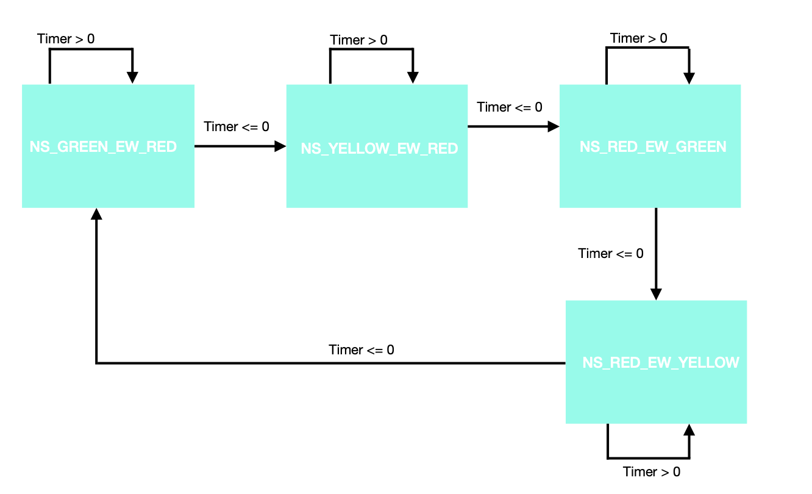

# Traffic Light State Machine
This repo goes over a state-machine for a traffic light problem. 



## Building repo guide
List of commands:
```
clean -- cleans dir
help -- lists available commands
test -- build test file exe
all -- build all exe's
```
To build
`make clean all`

